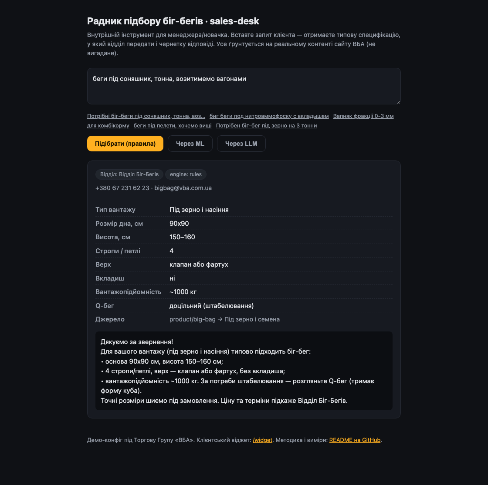
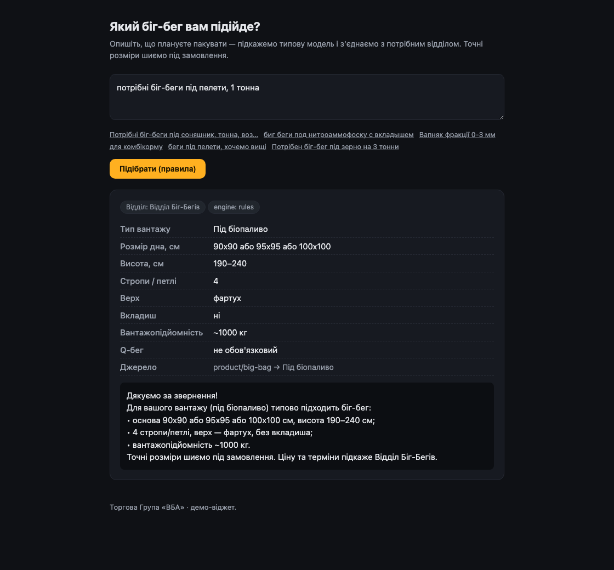
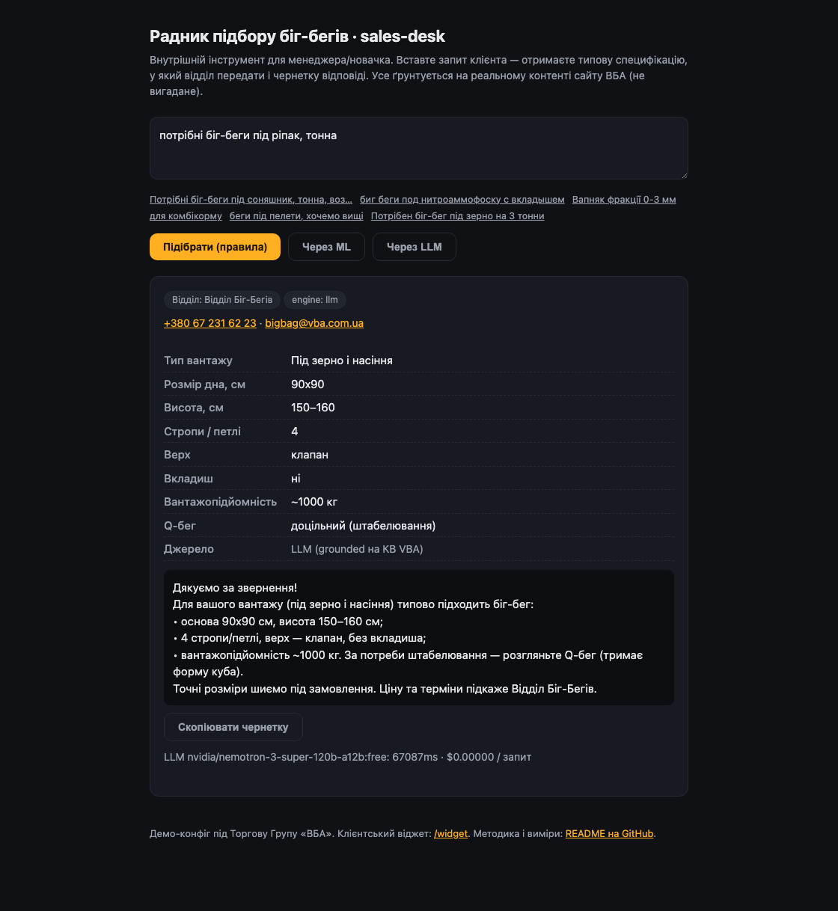

# bigbag-advisor

[](https://github.com/Volodymyr4K/bigbag-advisor/actions/workflows/ci.yml)
[](LICENSE)

[🇺🇦 Українська](README.md) · 🇬🇧 English

> **Why a business cares (in two sentences):** a sales rep types the customer's request as-is
> and, in a second, gets a ready big-bag spec, the right department, and a draft reply. Less
> busywork, a new hire is productive on day one, and the customer immediately sees who to contact.

A big-bag (FIBC) spec advisor + inbound-request router for departments. The demo is
configured for a real company — **Trade Group VBA** ([vba.com.ua](https://vba.com.ua/uk/)),
a manufacturer of big-bags, limestone and mineral powder.

**What it does:** a sales rep (or a customer on the site) types free text —
*"big bags for sunflower, one ton, shipping by rail"* — and the system returns:

1. a **typical big-bag spec** (size, loops, liner, top, Q-bag),
2. **which department** the request should go to (big-bags / limestone-powder / general),
3. a **draft reply** to the customer.

> Every recommendation is grounded in **VBA's real website content** (product pages).
> These aren't invented tips — it's a formalization of what VBA already writes to customers by hand.

## What it looks like

**Internal sales-desk** (`/`) — for a rep/new hire: spec, department, draft reply:



**Customer widget** (`/widget`) — same core, simpler interface for the website:



**LLM mode** — handles rare/new vocabulary the rules don't know. On the word "rapeseed"
(rules don't recognize it and honestly hand off to a department) the LLM produces a full spec:



> ℹ️ The public Vercel demo has the LLM off (it needs a paid key) — this screenshot shows what
> it adds. The high latency in the shot is a free model under load; a paid model answers in ~1–2 s.

---

## Why this exists, honestly

This is not "yet another chatbot". The point of the project is to **measure where AI is
actually needed and where something simpler is enough**. Picking a big-bag looks like an
LLM task, but VBA's page is in fact a near-deterministic table: cargo type → spec. So the
correct engineering stance is to climb the **ladder bottom-up**: dumb rules first, then
classical ML, and only then an LLM — **measuring at each rung whether the higher rung is
worth it**. No hype — just a measured result: on our data **rules win at routing, while the
LLM wins at classifying rare vocabulary**; the combination works best (details and caveats
below).

For the business there is a concrete cost of error: an invented spec (a size VBA doesn't
sew) = a wrong order = lost money. That's why we measure **hallucinations** separately.

---

## Measured results

The decision ladder — **rules → classical ML → LLM** — on two sets. The benchmark is
reproducible with one script (`npm run bench`):

- **DEV** (`src/eval/dataset.ts`, 33 cases) — the set I tuned the rules' synonym list on.
  Rules have a "home advantage" here: they've seen this vocabulary.
- **HELD-OUT** (`src/eval/heldout.ts`, 44 fresh cases) — the **main** set. The rules never
  saw these lines, the ML never trained on them. It deliberately includes unseen vocabulary
  ("rapeseed", "superphosphate", "husk", "gravel", "expanded clay", "chickpea"). This is
  where real generalization shows.

ML is pure TypeScript — a multinomial Naive Bayes over character n-grams (`src/ml/`),
trained on a **synthetic** set (`src/ml/traindata.ts`).

### DEV (rules' home advantage)

| Engine | Department | Category | Hallucinations ↓ |
|---|---|---|---|
| rules | **100% (33/33)** | **100% (22/22)** | 0% |
| ml (NaiveBayes) | 85% (28/33) | 86% (19/22) | 0% |

### HELD-OUT (fresh vocabulary — the honest picture)

> **Why rules score only 48% category here — it's intentional, not "broken".** This set is
> **deliberately** built from words the rule author never anticipated ("rapeseed",
> "superphosphate", "expanded clay"). On typical requests (the DEV tab above) rules score 100%.
> The point is the gap **48% → 83–97%**: it shows where simple rules give up and where AI
> genuinely adds value.

All engines are grounded (VBA's knowledge base in the prompt). LLM rows are free instruct
models via OpenRouter. The "spec for a non-big-bag query ↓" column = answered with a spec on
a query that ISN'T about big-bags (should have stayed silent and routed to a department).

| Engine | Department | Category | Spec on non-bag ↓ | Latency |
|---|---|---|---|---|
| rules | **98% (43/44)** | 48% (14/29) | 0% (0/15) | **0ms** |
| ml (NaiveBayes) | 84% (37/44) | 59% (17/29) | 0% (0/15) | **0ms** |
| nemotron-nano-9b-v2:free | 93% (41/44) | 83% (24/29) | 7% (1/15) | ~11.7s |
| nemotron-3-super-120b:free | **100% (44/44)** | 93% (27/29) | 0% (0/15) | ~13.3s |
| nex-n2-pro:free | **100% (44/44)** | **97% (28/29)** | 0% (0/15) | ~10.6s |

> The result is robust: **three** different instruct models consistently score **83–97%**
> category vs 48% for rules.
>
> 💡 To reproduce, use an **instruct** model (not a reasoning model): reasoning models often
> return prose instead of JSON.
>
> ⚠️ Free-model availability is flaky: several (`gemma-4-31b`, `qwen3-coder`, `llama-3.2-3b`,
> `dolphin`) returned solid 429s at test time — no data for them. The NVIDIA family
> (`nemotron-*`) and `nex-n2-pro` were reliable. The ~10–13 s latency is a free-endpoint
> property; a paid model would be faster.

👉 **Per-case breakdown** of every held-out miss (who predicted what, ✓/✗):
[`docs/heldout-report.md`](docs/heldout-report.md) — generated by `npm run report`.
Note the nuance: on "rapeseed" ML guessed `grain`, while on "superphosphate" it wrongly gave `oilcake`.

### What these numbers honestly say

1. **The 100% on DEV was an illusion.** On HELD-OUT category classification drops to **48%**.
   Rules hold exactly on the vocabulary the author anticipated; new words ("rapeseed",
   "superphosphate", "expanded clay") break them. That's the measured cost of a keyword approach.
2. **ML gives a modest edge — but no rescue.** Category: **59% (17/29) vs 48% (14/29)** for
   rules. On n=29 that's no longer pure noise: char n-grams sometimes generalize to unseen
   words (on "rapeseed" ML guessed `grain`). BUT on routing ML is **worse** (84% vs 98%), and
   both fail most of the new vocabulary. Honest conclusion: on synthetic data ML gives **no
   clear-cut win** — better in places, worse in others. Its superpower (learning from data)
   has nothing to learn from: there's no real labelled corpus yet.
3. **Routing holds up better than classification** (84–98% for rules/ML): telling "big-bag vs
   limestone" apart is easier than the exact cargo type.
4. **The LLM wins exactly where rules/ML are weak — classifying new vocabulary.** Category:
   **83–97% across three instruct models** vs **48%** for rules and **59%** for ML. Words the
   author never anticipated ("rapeseed", "superphosphate", "expanded clay") the LLM recognizes,
   the rules don't. Two of three (`nemotron-3-super`, `nex`) also hit **100% routing**. The
   price: **~10–13 s** per query (free endpoints) and, for `nemotron-nano`, one stray spec on a
   non-big-bag query (1/15) — minor off-topic; the others 0%.
5. **Routing is the opposite — cheap rules win on value.** rules 98% at 0 ms and free; the LLM
   matches it (nex 100%) but you pay ~10 s of latency. Telling "big-bag vs limestone" apart is
   easy without an LLM.
6. **The knowledge base genuinely keeps the LLM from making things up.** The same
   `nemotron-nano` **without** the knowledge base (no-ground) answered with a spec on **53%
   (8/15)** of non-big-bag queries — where it should have stayed silent; **with** the knowledge
   base, only **7% (1/15)**. So grounding cuts off-topic answers ~8×: the KB is needed not just
   for accuracy but to stop the model inventing answers where it shouldn't.

**Honest takeaway (a nuance, not a slogan):** the right answer is a **combination**, not
"all-LLM" nor "no LLM":
- **department routing** → rules (instant, free, 98%);
- **precise classification of rare/new cargo** → LLM (97% vs 48%), but only where rules genuinely
  fall short — so you pay latency/cost only when it buys accuracy.

In short: the question isn't "LLM or rules" but **which tool at which step** — and the answer
here comes from measurement, not opinion.

**Caveat (so as not to overclaim):** the sample is small (n=29 categories), numbers are
indicative; tested on **three** instruct models because the other free models were unavailable
(429) at run time. A paid model would be faster and probably no worse.

```bash
cp .env.example .env          # OPENROUTER_API_KEY (+ LLM_MODEL if needed)
npm run bench                 # rules / ML / LLM / LLM-no-ground on held-out (single model)

# Compare several LLMs at once (parallel), with no-ground:
LLM_MODELS="nvidia/nemotron-nano-9b-v2:free,nex-agi/nex-n2-pro:free" LLM_WITH_NOGROUND=1 \
  node --env-file=.env --import tsx src/eval/llm-models.ts
```

---

## Run

```bash
npm install
npm run dev            # web: http://localhost:3000
```

- `/` — internal **sales-desk** for a rep/new hire.
- `/widget` — simplified **customer widget** for the website.

### Embedding the widget on a site

`?embed=1` strips the extra chrome (header/footer) for a clean `<iframe>`:

```html
<iframe
  src="https://YOUR-HOST/widget?embed=1"
  title="Big-bag advisor"
  style="width:100%;max-width:760px;height:640px;border:0"
  loading="lazy">
</iframe>
```

Benchmark:

```bash
npm test               # tests of the core logic (no API)
npm run bench:offline  # rules + ML (no key, free)
npm run bench          # + LLM (needs OPENROUTER_API_KEY)
npm run report         # per-case held-out breakdown → docs/heldout-report.md
npm run scrape         # re-pull VBA pages + verify "beacons" (provenance)
```

---

## Architecture

```
data/
  knowledge-base.json     # source of truth: spec rules, catalog, departments (from VBA's site)
  raw/                    # raw text of VBA pages (provenance — where the facts came from)
src/core/
  rules.ts                # RULES baseline: keywords → category, department, spec
  ml.ts                   # ML engine: classifier → category, then spec from KB
  llm.ts                  # LLM via OpenRouter: grounded / no-ground
  kb.ts                   # KB loader + "out-of-catalog" detector (= hallucination)
  misslog.ts              # flywheel: logs low-confidence queries (future ML corpus)
  types.ts
scripts/
  scrape.ts               # provenance: re-pull VBA pages + verify "beacons"
src/ml/
  classifier.ts           # multinomial Naive Bayes over char n-grams (pure TS)
  traindata.ts            # SYNTHETIC training data (clearly labelled as such)
src/eval/
  dataset.ts              # DEV: 33 cases (UA/RU/EN + traps) — rules were tuned here
  heldout.ts              # HELD-OUT: 44 fresh cases with unseen vocabulary
  bench.ts                # rules vs ml vs llm vs llm-no-ground → two metric tables
  report.ts               # per-case held-out breakdown → docs/heldout-report.md
src/app/                  # Next.js: /desk, /widget, /api/advise, /api/misses
```

The core (`src/core`) doesn't depend on Next — the web app and the CLI bench import it equally.

**The hallucination detector** (`kb.ts → outOfCatalog`) is deterministic: any spec is checked
against VBA's allowed catalog (base sizes, loop counts, load capacity 500–2000 kg, fabric
density 110–200 g/m²). A value outside the set = a hallucination. That's how we catch made-up
specs even from an LLM — with no "LLM judge".

---

## How it fits real work inside the company

One core covers several real VBA processes:

- **saves a rep's time** — no need to keep the spec matrix in your head;
- **onboarding** — the bot is a living knowledge base for the sales team;
- **routing** — a request goes straight to the right department (VBA already splits them:
  big-bags / limestone+powder);
- **AI assistant for customers** — the same engine as a widget on the site.

Deployment: an internal web app for reps, or an embedded `<iframe>` widget on the site.
The LLM layer is switched on only where rules measurably lose — not "because AI".

**Data-collection flywheel.** The measurements exposed the main gap: classical ML is
data-starved because there's **no labelled corpus of requests yet**. So the system collects
one itself: every query where it couldn't give a confident spec (low confidence / "general"
department) is quietly logged ([`src/core/misslog.ts`](src/core/misslog.ts) →
`data/miss-log.jsonl`, view via `GET /api/misses`). Over months this becomes a real dataset
the ML can finally learn from. Two honest caveats: on serverless (Vercel) the filesystem is
ephemeral — in production this should point at a DB; and since the endpoint returns real
customer query text, set env `MISSES_TOKEN` to lock it before any public deploy (without it
the endpoint is open — local use only).

📄 Detailed rollout plan for VBA (processes, staff instructions, how to measure
effectiveness, where AI is **not** needed): [`docs/vba-rollout.md`](docs/vba-rollout.md).

---

## Limitations (honestly)

- The sets are small (DEV 33, HELD-OUT 44) and author-curated; even on n=29 category cases
  the numbers are indicative only. This is a demonstration of **method**, not a production
  validation.
- ML is trained on **synthetic** data (the business has no real request corpus yet) — so its
  "loss" to rules is expected and honest, not a verdict on classical ML in general.
- The LLM was measured on **free** instruct models (via OpenRouter; the key has a $0 limit that
  blocks paid models). Clean full data came from three (`nemotron-nano-9b-v2`,
  `nemotron-3-super-120b`, `nex-n2-pro`) — the
  other free models were unavailable (429) at test time. The ~10–12 s latency is a free-endpoint
  property; a paid model would be faster.
- **Variance measured partially.** `nemotron-nano` over 3 grounded runs gave category
  **83–86%** (small spread — the numbers are stable). Full 3× variance for all models and
  no-ground for `super`/`nex` could **not** be collected: under sustained load the free
  endpoints throttle (a single call is ~0.5 s, but a 44-call pass degrades to timeouts).
  Rigorous variance needs a stable (paid) endpoint — that's the next step.
- The spec is **typical**, not final: VBA sews to order, a manager confirms final sizes. The
  advisor states this in every reply.
- The rules' synonym list must be extended for new vocabulary (this is exactly where an LLM
  may help — to be seen from the benchmark).
- Model prices in `llm.ts` are approximate, for order-of-magnitude cost estimation.

## Approach (not a template)

This project was built **for VBA** — on their real content, around their departments and
products. The method behind it is my usual one: **first measure where AI actually helps and
where something simpler (rules / classical ML) is enough**, with a baseline from the bottom, a
fixed dataset and a reproducible benchmark — not "because AI". I apply the same approach
elsewhere too, e.g. [clauselens](https://github.com/Volodymyr4K/clauselens) (legal clauses with
eval) and [deskbench](https://github.com/Volodymyr4K/deskbench) (front-desk for service businesses).

## Stack

Next.js (App Router) · TypeScript · classical ML in pure TS (no Python/deps) · LLM via an
OpenAI-compatible endpoint (OpenRouter).
No DB: the knowledge base is a versioned JSON, so a non-programmer can edit it.

MIT.
